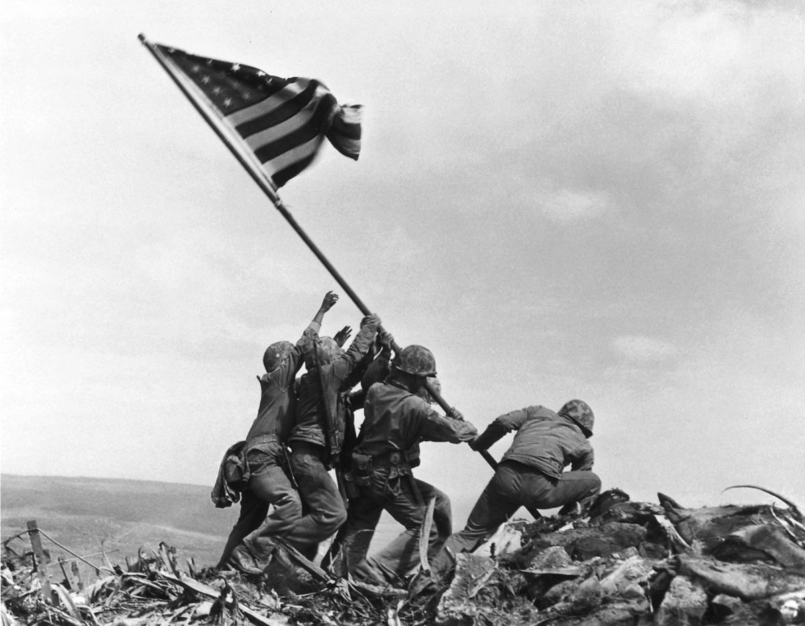
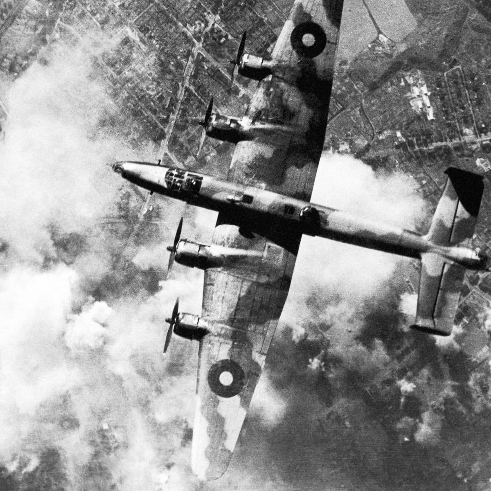
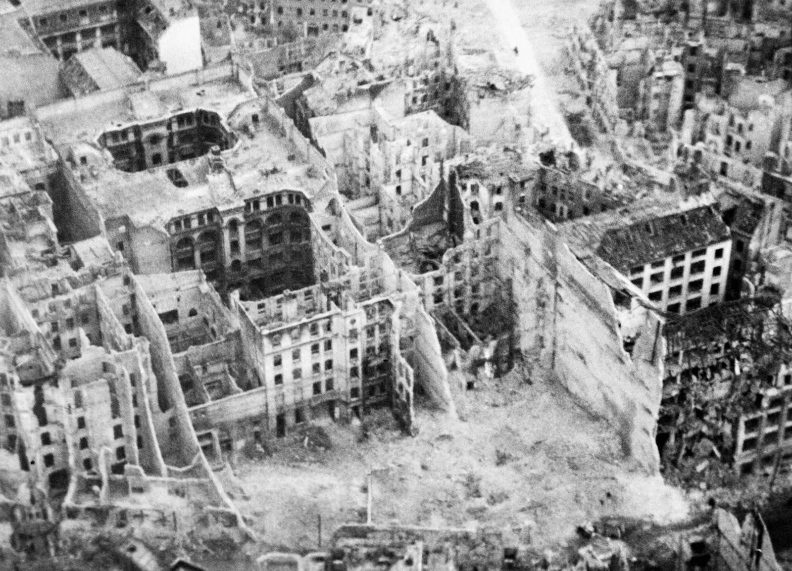

<h1>
<strong> Project 2: Visualizing Weapons, Weather, and Aircraft Data from World War II </strong>

 

</h1>

https://wwii.herokuapp.com/

“EVERY DAY, MEMORIES OF WORLD WAR II—ITS SIGHTS AND SOUNDS, ITS TERRORS AND TRIUMPHS—DISAPPEAR.”

 - www.nationalww2museum.org    

 

## Background

Welcome to the World War II Visualizations Dashboard where you will be able to dive deeper into the historical events of this war occurring between 1942-1945. The goal of our visualizations is to provide the user with a comprehensive overview of major bombing events, where and when they occurred, and how weather conditions may have affected these missions

### Visualizations

The first visual is an interactive map which allows the user to explore data we found on WWII aerial bombing events that occurred between 1942 and 1945 within all theaters. This tells us a visual story of the major bombing events that took place during WWII and how these may have influenced the overall trajectory of the war. 

Our second visual is an interactive table chart that shows the detailed stats of the data we found including aircraft used to transport the bombs, weapons locations, etc. and gives the user the opportunity to see the war unfold in a chronological order, with the opportunity to select and interact with specific dates in history.

### Datasets Used 

   

   https://www.kaggle.com/smid80/weatherww2%22%20%5Ct%20%22_blank
   https://data.world/datamil/world-war-ii-thor-data
    
   <i>Andrew Zamora, Vanessa Simpson, Ibet Hernandez</i>
    
   <i>UTSA | Trilogy Data Analytics Bootcamp 2020</i>
